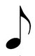
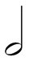

# Metronome
***

Функциональность
=====================

**Режимы работы**
1. *Ритмический рисунок* - вместо каждого удара подставляется ритмический рисунок, общим размером 4.	
2. *Размер* - игра под указанный размер.
3. *Акцент* - номер акцентированного удара.

Теория
=====================

**Характеристики**  
*BPM* (beats per minute - удары в минуту) - количество четвертых нот композиции в минуту.

**Длительности нот:**  
*Четвертная нота* - нота, имеющая длительность 60 / BPM [сек]. 
Обозначается значком закрашенной ноты с палкой без флага.  
Имеются ноты с меньшей длительностью:
1. *Восьмая нота* - нота, длительность которой в два раза меньше чем у четвертной ноты.
	Обозначается значком закрашенной ноты с палкой и одним флагом.
2. *Шестнадцатая нота* - нота, длительность которой в четыре раза меньше чем у четвертной ноты. 
	Обозначается значком закрашенной ноты с палкой и двумя флагами.
3. И т.д.
  
Также имеются ноты с большей длительностью чем у четвертной:
1. *Половинная нота* - нота, длительность которой в два раза больше чем у четвернтой ноты.
	Обозначается значком не закрашенной ноты с палкой без флага.
2. *Целая нота* - нота, длительность которой в четры раза больше чем у четвернтой ноты.
	Обозначается значком не закрашенной ноты без палки и флага.

Таким образом можно выявить общую закономерность:   
*N нота* имеет длительность 60 / (BPM * N/4) [сек], где N четное положительное число (икслючение N = 1).   

**Изображения нот:**
 
 

*Четвертная нота*
 
 

*Восьмая нота*
 
 

*Шестнадцатая нота*
 
 

*Половинная нота*
 
 

*Целая нота*

